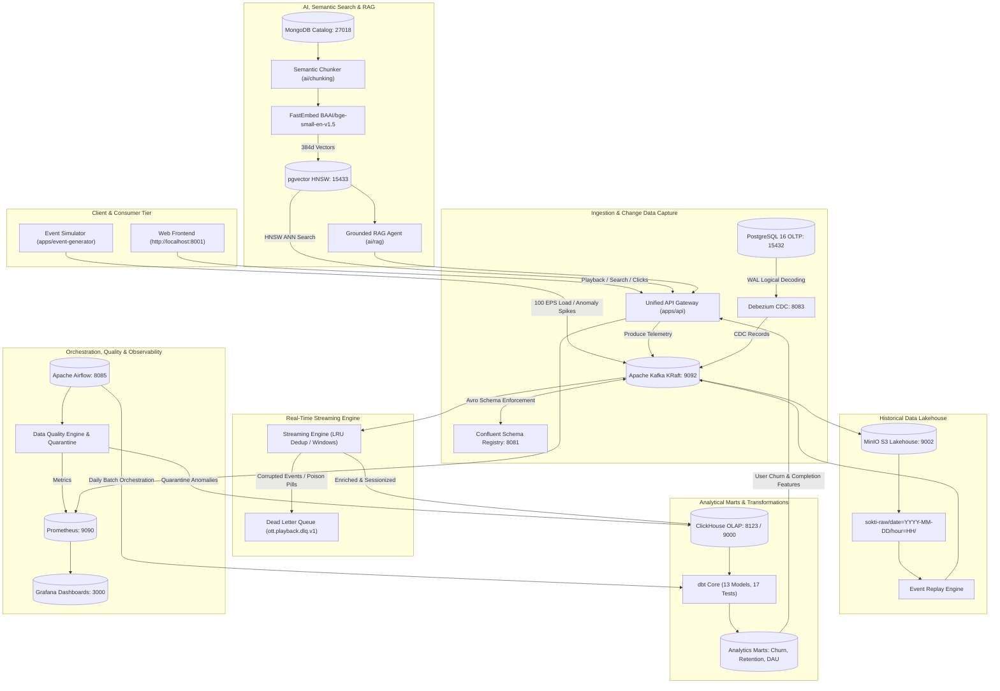

<div align="center">

# 🎬 SOKTI — Enterprise OTT Data Platform
### *Production-Grade, Local-First Streaming & Analytics Architecture for High-Concurrency Media Services*

[](.github/workflows/ci.yml)
[](https://python.org)
[](docker-compose.yml)
[](ingestion/kafka/)
[](databases/clickhouse/)
[](dbt/)
[](ai/embeddings/)
[](orchestration/airflow/)

<p align="center">
  <b><a href="#-quickstart-in-3-minutes">Quickstart</a></b> •
  <b><a href="#-system-architecture">Architecture</a></b> •
  <b><a href="#-interactive-web-frontend">Web UI</a></b> •
  <b><a href="#-data-pipelines--deep-dive">Pipelines Deep Dive</a></b> •
  <b><a href="#-ai-semantic-search--rag">AI & RAG</a></b> •
  <b><a href="#-governance--dpdp-compliance">Governance</a></b> •
  <b><a href="#-observability--telemetry">Observability</a></b> •
  <b><a href="#-production-iac-terraform--k8s">IaC</a></b>
</p>

</div>

---

## 📖 Overview

**Sokti** is an end-to-end data platform engineered to mirror the production telemetry, analytical lakehouse, and recommendation systems of hyperscale OTT media streaming services (such as Netflix, Prime Video, or Disney+ Hotstar).

Built to be **100% runnable locally via Docker Compose**, Sokti enforces cloud-native software engineering patterns across:
- **Operational OLTP:** PostgreSQL 16 (Users, Subscriptions, Devices, Watchlists).
- **Document Catalog:** MongoDB 7.0 (Movies, Series, Episodes, Subtitles).
- **Change Data Capture (CDC):** Debezium streaming PostgreSQL WAL modifications into Kafka.
- **Event Streaming Backbone:** Apache Kafka (KRaft mode) + Confluent Schema Registry (Avro).
- **Stateful Stream Processing:** Flink-style pipeline with LRU deduplication, watermarks, sessionization, and Dead-Letter Queue (DLQ).
- **Analytical OLAP Store:** ClickHouse 24.3 with high-performance MergeTree engines, TTLs, and Materialized Views.
- **Data Modeling:** dbt Core ClickHouse (13 models, 17 automated integrity tests).
- **Lakehouse Historical Archival:** MinIO S3 storing date-partitioned Parquet files with point-in-time event replay.
- **AI & Vector Retrieval:** FastEmbed (`BAAI/bge-small-en-v1.5`) + PostgreSQL `pgvector` HNSW index for sub-10ms semantic similarity.
- **RAG Recommendation Assistant:** Grounded conversational OTT discovery agent.
- **Interactive Web Frontend:** Cinema-grade streaming UI with live Kafka telemetry emitter and simulated playback player.
- **Data Governance:** DPDP Act & GDPR compliant PII masking and automated Right-to-be-Forgotten erasure workflows.
- **Observability & SRE:** Prometheus alerting rules, Grafana dashboards, and OpenLineage metadata emission.

---

## 🏛 System Architecture



---

## 🔌 Service Topology & Port Matrix

All infrastructure services run locally inside isolated containers on Docker network `sokti-net`:

| Subsystem | Service Name | Container Name | Host Port | Internal Port | Healthcheck / Probe | Credentials |
| :--- | :--- | :--- | :--- | :--- | :--- | :--- |
| **Operational Store** | PostgreSQL 16 | `sokti-postgres` | `15432` | `5432` | `pg_isready` | `postgres` / `postgres` (`sokti`) |
| **Vector Database** | PostgreSQL + pgvector | `sokti-pgvector` | `15433` | `5432` | `pg_isready` | `postgres` / `postgres` (`postgres`) |
| **Metadata Catalog**| MongoDB 7.0 | `sokti-mongodb` | `27018` | `27017` | `mongosh --eval 'db.adminCommand("ping")'` | `admin` / `admin` (`sokti_metadata`) |
| **Message Broker** | Apache Kafka 3.6 (KRaft) | `sokti-kafka` | `9092` | `29092` | `kafka-broker-api-versions.sh` | None (PLAINTEXT) |
| **Schema Governance**| Schema Registry | `sokti-schema-registry` | `8081` | `8081` | `curl -f http://localhost:8081/subjects` | None |
| **Change Data Capture**| Kafka Connect (Debezium)| `sokti-kafka-connect` | `8083` | `8083` | `curl -f http://localhost:8083/connectors` | None |
| **OLAP Engine** | ClickHouse 24.3 LTS | `sokti-clickhouse` | `8123` / `9000` | `8123` / `9000` | `wget -qO- http://127.0.0.1:8123/ping` | `default` / `sokti_pass` (`sokti`) |
| **Lake Storage API**| MinIO S3 | `sokti-minio` | `9002` | `9000` | `curl -f http://localhost:9000/minio/health/live` | `minioadmin` / `minioadmin` |
| **Lake Storage Web**| MinIO Console | `sokti-minio` | `9001` | `9001` | Browser Console | `minioadmin` / `minioadmin` |
| **Batch Orchestrator**| Apache Airflow 2.9.1 | `sokti-airflow` | `8085` | `8080` | `curl -f http://localhost:8080/health` | `admin` / `admin` |
| **Metrics Collector**| Prometheus v2.51 | `sokti-prometheus` | `9090` | `9090` | `wget -qO- http://localhost:9090/-/healthy` | None |
| **Observability Board**| Grafana 10.4 | `sokti-grafana` | `3000` | `3000` | `curl -f http://localhost:3000/api/health` | `admin` / `admin` |
| **OTT Web Frontend**| Unified FastAPI App | Local Process | `8001` | `8001` | `curl -f http://localhost:8001/health` | [Open UI](http://localhost:8001) |

---

## ⚡ Quickstart in 3 Minutes

### 1. Prerequisites
- Docker Engine 24+ & Docker Compose v2+
- Python 3.10+ (Python 3.12 recommended)
- `pip install -r requirements.txt`

### 2. Start Infrastructure
Launch all 11 core containers:
```bash
make up
# or: docker compose up -d
```
Verify container health:
```bash
make ps
```

### 3. Seed Synthetic Data
Populate PostgreSQL (1,000 synthetic users, devices, active subscriptions) and MongoDB (110+ rich movies, series, episodes, and subtitles):
```bash
make seed
```

### 4. Register Schemas & CDC Connectors
```bash
# Register Avro schemas with Schema Registry
python ingestion/schemas/register_schemas.py

# Deploy Debezium PostgreSQL connector
python cdc/debezium/register_connector.py
```

### 5. Vectorize Catalog for AI
Extract metadata, generate 384d FastEmbed dense vectors, and populate pgvector with HNSW index:
```bash
make vector-sync
```

### 6. Run dbt Analytics Modeling
Execute the 13 staging, intermediate, and analytical mart models in ClickHouse:
```bash
make dbt-run
make dbt-test
```

### 7. Launch Interactive OTT Web Frontend
```bash
make frontend
```
Open **[http://localhost:8001](http://localhost:8001)** in your browser!

---

## 🖥 Interactive Web Frontend

The platform features an interactive OTT streaming application accessible at `http://localhost:8001`:

```
┌─────────────────────────────────────────────────────────────────────────────┐
│ SOKTI.   Browse  Trending  Personalized  Sci-Fi   [Search with AI...]  (👤) │
├─────────────────────────────────────────────────────────────────────────────┤
│                                                                             │
│   COSMIC HORIZON (Part 42)    [4K ULTRA HD] [U/A 16+] [2024]                │
│   An intrepid crew journeys across wormholes to rescue humanity...          │
│   [▶ Play Now]   [✨ Ask AI About This]                                      │
│                                                                             │
├─────────────────────────────────────────────────────────────────────────────┤
│ 🚀 Try AI Searches: [🤖 Cyberpunk Bounty Hunter] [🚀 Space Wormholes]        │
├─────────────────────────────────────────────────────────────────────────────┤
│ 🔥 Trending Movies & Series               ✨ Recommended For You (AI)       │
│ ┌──────┐ ┌──────┐ ┌──────┐ ┌──────┐       ┌──────┐ ┌──────┐ ┌──────┐        │
│ │Neon  │ │Delhi │ │Tech  │ │Silent│       │Cosmic│ │Echoes│ │Neon  │        │
│ │Nights│ │Ledger│ │Heist │ │Echoes│       │Horiz │ │      │ │Nights│        │
│ └──────┘ └──────┘ └──────┘ └──────┘       └──────┘ └──────┘ └──────┘        │
└─────────────────────────────────────────────────────────────────────────────┘
```

### Real-Time Capabilities:
1. **User Profile Switcher:** Select any of the 1,000 PostgreSQL subscribers from the top-right dropdown. All PII is masked on the fly (`t***r@sokti-stream.com`), and switching users recalculates the personalized recommendation carousel using their ClickHouse historical engagement profile.
2. **Interactive Video Player:** Click any card to launch the player simulation. Play, Pause, -10s, +10s, Timeline Scrubbing, and Complete buttons trigger live events.
3. **Kafka Telemetry HUD:** Every player action fires an HTTP request to `/api/v1/events/playback`, which writes directly to Kafka topic `ott.playback.events.v1`. A pulsating HUD toast appears with the real-time partition acknowledgement:
   ```
   [Kafka Ingress] Topic: ott.playback.events.v1 | Key: <user_id> | Event: video_play | Position: 45.0s
   ```
4. **AI Semantic Vector Search:** Search across catalog plots using natural language powered by pgvector HNSW cosine similarity.
5. **Grounded RAG Assistant:** Click "Ask AI (RAG)" to chat with an assistant that retrieves catalog chunks and answers user queries with cited titles and relevance percentages.
6. **Live Telemetry Modal:** Click the green "Pipeline Live" badge to inspect ClickHouse row counts, Kafka status, and active session counts.

---

## 📊 Data Pipelines & Deep Dive

### 1. Ingestion & Event Model (Avro + Kafka)
- **Avro Schemas:** Located in `ingestion/schemas/`: `playback_event.avsc`, `search_event.avsc`, `recommendation_event.avsc`, `user_event.avsc`, `subscription_event.avsc`.
- **Partitioning Strategy:** Events on `ott.playback.events.v1` (6 partitions) are partitioned on `user_id` or `session_id`. This guarantees per-user FIFO order within a partition, enabling accurate stateful session duration tracking without distributed cross-partition joins.
- **Traffic Simulation:**
  ```bash
  python apps/event-generator/generate.py --users 1000 --events-per-second 100 --spike-multiplier 3.0 --invalid-rate 0.01
  ```

### 2. Change Data Capture (Debezium + PostgreSQL WAL)
- Captures row-level mutations on `users`, `subscriptions`, and `plans` via `pgoutput` plugin.
- Connector configuration: `cdc/debezium/register_connector.py`.
- Automated CDC test: `tests/integration/test_cdc_pipeline.py`.

### 3. Stateful Stream Processing (Flink Architecture)
- Job located at `streaming/flink/jobs/playback_streaming_pipeline.py`.
- **LRU Deduplication:** In-memory LRU cache deduplicates incoming events by `event_id`.
- **Event-Time Watermarks:** 15-minute bounded-out-of-orderness tolerance for late-arriving events.
- **Dead-Letter Queue:** Schema-corrupted events and poison pills are safely isolated to `ott.playback.dlq.v1`.
- **Tumbling Windows:** Aggregates events per minute and computes watch session durations.

### 4. Analytical Data Modeling (ClickHouse + dbt)
- **Engine Selection:** ClickHouse `MergeTree` engines with date partitioning (`PARTITION BY toYYYYMM(event_time)`) and sparse primary indexing (`ORDER BY (event_type, user_id, event_time)`).
- **dbt Models (13 Total):**
  - **Staging:** `stg_playback_events` (with `row_number() OVER (PARTITION BY event_id)` deduplication), `stg_search_events`, `stg_users`, `stg_content`.
  - **Intermediate:** `int_watch_sessions`, `int_daily_user_activity`, `int_content_engagement`, `int_subscription_history`.
  - **Marts:** `mart_daily_platform_metrics`, `mart_content_performance`, `mart_user_retention`, `mart_recommendation_performance`, `mart_churn_features`.
- **Data Tests (17 Total):** Unique keys, not null, accepted values, bounded completion percentages (`0 <= completion_rate <= 100`), positive watch times.
- **Benchmarking Report:** Poor vs. optimized ClickHouse table designs documented in [docs/clickhouse_benchmarks.md](docs/clickhouse_benchmarks.md) (showing ~10x scan speedups).

### 5. Historical Lakehouse & Event Replay (MinIO S3)
- Real-time writer: `data_lake/writers/kafka_to_parquet_lake.py` captures raw events into date/hour partitioned Parquet (`sokti-raw/date=YYYY-MM-DD/hour=HH/`).
- **Point-in-Time Event Replay:**
  ```bash
  python data_lake/replay_events.py --date 2026-10-05 --speed 2.0
  ```
- **Iceberg Schema Definitions:** Production definitions documented in `data_lake/schemas/iceberg_table_definitions.sql`.

### 6. Batch Orchestration (Apache Airflow)
- Access web console at `http://localhost:8085` (`admin` / `admin`).
- **3 Production DAGs:**
  1. `daily_batch_pipeline_dag`:
     `wait_for_daily_data` → `validate_raw_partition` → `run_dbt_staging` → `run_dbt_intermediate` → `run_dbt_marts` → `run_quality_checks` → `build_ml_dataset` → `generate_embeddings` → `publish_dataset` → `final_health_check`.
  2. `retention_metrics_dag`: Daily cohort calculation for 1-day, 7-day, 14-day, and 30-day user return rates.
  3. `content_embedding_refresh_dag`: Hourly delta sync of catalog changes into pgvector.

---

## 🧠 AI, Semantic Search & RAG

```
[MongoDB Catalog] ──> [Semantic Chunker] ──> [FastEmbed BAAI/bge-small-en-v1.5]
                                                              │
                                                              ▼ (384d Dense Vectors)
[User Query] ───────> [pgvector HNSW Cosine Index] ────────> [Top-K Context]
                                                              │
                                                              ▼
                                                     [Content RAG Agent]
                                                              │
                                                              ▼
                                                   [Grounded Recommendation]
```

- **Dense Embedding Model:** FastEmbed ONNX `BAAI/bge-small-en-v1.5` generating normalized 384-dimensional dense vectors.
- **Vector Store:** PostgreSQL 16 `pgvector` with HNSW cosine distance index (`vector_cosine_ops`).
- **REST Endpoints:**
  - `POST /api/v1/search/semantic`: Pure vector similarity search.
  - `POST /api/v1/rag/ask`: Grounded question-answering with citation scores.
  - `GET /api/v1/recommendations/{user_id}`: Personalized hybrid recommendations combining ClickHouse churn engagement features with pgvector similarity.

---

## 🛡 Governance & DPDP Compliance

Sokti implements comprehensive governance compliant with the **Digital Personal Data Protection Act (DPDP Act 2023)** and **GDPR**:

- **PII Inventory Catalog:** Detailed in [governance/pii_catalog.yaml](governance/pii_catalog.yaml) classifying fields by sensitivity (`CONFIDENTIAL_PII`, `PSEUDONYMOUS_IDENTIFIER`, `PUBLIC_METADATA`).
- **Dynamic Masking Engine:** [governance/masking/pii_masker.py](governance/masking/pii_masker.py) masks direct identifiers before reaching analytical views or consumer APIs:
  - `user@example.com` → `u***r@example.com`
  - `+919876543210` → `+91-XXXXX-3210`
- **Right-to-be-Forgotten Workflow:**
  Cascading erasure across OLTP, OLAP, and streaming brokers:
  ```bash
  python scripts/delete_user.py --user-id <UUID>
  ```
  Deletes personal records from PostgreSQL, issues ClickHouse mutations (`ALTER TABLE ... DELETE WHERE user_id = <UUID>`), and emits Kafka tombstone records.
  Full documentation in [docs/governance.md](docs/governance.md).

---

## 🚨 Observability & Self-Healing

- **Prometheus Alerting Rules:** Configured in [observability/prometheus/alerts.yml](observability/prometheus/alerts.yml):
  - `ConsumerLagHigh`: Kafka consumer lag exceeds 500 for > 2m.
  - `DLQRateElevated`: Dead-letter queue message rate exceeds 5 msgs/sec.
  - `DataQualityFailure`: Automated DQ check reports failure.
  - `AirflowTaskFailure`: Batch DAG failure detected.
- **Grafana Operational Dashboard:** Auto-provisioned in [observability/grafana/dashboards/sokti_platform_overview.json](observability/grafana/dashboards/sokti_platform_overview.json) displaying throughput (EPS), consumer lag, p95 latencies, and DQ pass rates.
- **Failure Injection Utility:**
  Simulate real-world production failure modes:
  ```bash
  python scripts/inject_failure.py --type duplicate      # Injects duplicate event_ids
  python scripts/inject_failure.py --type schema-drift   # Injects unauthorized schema payload
  python scripts/inject_failure.py --type null-content   # Injects empty content_id
  python scripts/inject_failure.py --type late-events    # Injects events 10 days in the past
  python scripts/inject_failure.py --type poison-pill    # Injects unparseable binary frame
  ```
- **Automated Remediation:** [data_quality/checks/remediation.py](data_quality/checks/remediation.py) scans `sokti.quarantine_events`, caps future timestamps, clamps impossible playback boundaries, and restores clean records. Detailed in [docs/failure_modes.md](docs/failure_modes.md).

---

## 🏗 Production IaC (Terraform & K8s)

- **Terraform AWS Topology:** [infra/terraform/main.tf](infra/terraform/main.tf) defines multi-AZ VPC, Amazon MSK (Managed Streaming for Kafka), Amazon RDS PostgreSQL (pgvector enabled), and S3 Lakehouse Bronze/Silver/Gold buckets.
- **Kubernetes Manifests:** [infra/kubernetes/api-deployment.yaml](infra/kubernetes/api-deployment.yaml) defines production Deployment, ClusterIP Service, readiness/liveness probes, and resource constraints for API microservices.

---

## 🧪 Automated Testing

Run the complete test suite:
```bash
# Run all unit, integration, and e2e tests
make test

# Or run specific test suites
pytest tests/integration/test_apis.py -v
pytest tests/e2e/test_end_to_end_flow.py -v
```

---

## 🧠 AI-Assisted Engineering Retrospective

A transparent retrospective analyzing failure modes in naive LLM generation and the production engineering interventions required is documented in [docs/ai-assisted-development.md](docs/ai-assisted-development.md).

### Real Issues Diagnosed & Resolved:
1. **`dbt-clickhouse` 1.10 Incompatibility with ClickHouse 24.3:** Fixed hardcoded deprecated setting `lightweight_deletes_sync` via driver monkey-patching ([scripts/patch_dbt_clickhouse.py](scripts/patch_dbt_clickhouse.py)).
2. **Alpine Linux IPv6 DNS Resolution in Docker Healthchecks:** Pinned `localhost` to IPv4 `127.0.0.1` in container health checks to prevent indefinite startup hangs.
3. **ClickHouse Multi-Table CTE Scoping:** Refactored ambiguous `ON` joins to native `USING (user_id)` syntax.
4. **MongoDB Multilingual Text Index Language Override:** Configured `language_override="none"` to support multilingual OTT catalog indexing without Japanese stemmer crashes.
5. **ClickHouse Strongly-Typed UUID Comparison:** Replaced string null-checks (`session_id = ''`) with native zero UUID representation (`session_id = toUUID('00000000-0000-0000-0000-000000000000')`).

---

## 📜 Makefile Reference Card

```bash
make up               # Start all 11 Docker infrastructure containers
make down             # Stop containers
make ps               # Check container health status
make logs             # Tail container logs
make seed             # Seed PostgreSQL (1,000 users) and MongoDB (110 titles)
make generate-events  # Run synthetic telemetry generator (100 EPS with spikes)
make dbt-run          # Execute all 13 dbt models against ClickHouse
make dbt-test         # Run all 17 dbt data tests
make dq-check         # Run Data Quality checks & quarantine routing
make vector-sync      # Vectorize MongoDB catalog into pgvector with HNSW
make frontend         # Launch interactive OTT web frontend on http://localhost:8001
make test             # Run complete pytest automated test suite
make clean            # Teardown containers and delete persistent volumes
```

---

<div align="center">
  <b>Developed for the Sokti Data Platform Initiative • MIT License</b>
</div>
