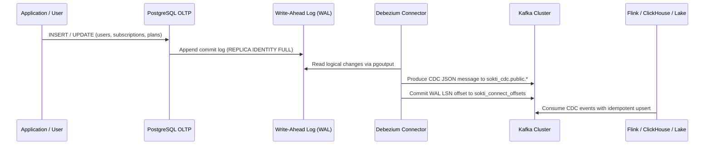

# Sokti Data Flow & Event Streaming Architecture

This document describes the telemetry event model, topic topology, stream partitioning rationale, and Change Data Capture (CDC) mechanics across the Sokti platform.

---

## 1. Event Model & Topic Topology

Sokti ingests high-throughput telemetry from web, mobile, smart TVs, and streaming sticks across five core streaming topics and one dead-letter queue (DLQ):

| Topic Name | Purpose | Partitions | Retention Policy | Partition Key |
| :--- | :--- | :--- | :--- | :--- |
| `ott.playback.events.v1` | Playback state transitions (`video_play`, `video_pause`, `video_seek`, `video_stop`, `video_complete`) | 6 | 7 days (delete) | `user_id` |
| `ott.search.events.v1` | Search queries, results counts, click selections | 3 | 7 days (delete) | `user_id` |
| `ott.recommendation.events.v1` | Recommendation rail impressions and user clickthroughs | 3 | 7 days (delete) | `user_id` |
| `ott.user.events.v1` | User lifecycle events (`login`, `logout`, `watchlist_add`) | 3 | 14 days (delete) | `user_id` |
| `ott.subscription.cdc.v1` | Operational state changes from Postgres CDC | 3 | 30 days (compact) | `user_id` |
| `ott.playback.dlq.v1` | Malformed, schema-violating, or corrupted events | 3 | 14 days (delete) | `event_id` |

---

## 2. Stream Partitioning Strategy: `user_id` vs `session_id`

### Decision
All user-facing event streams (`ott.playback.events.v1`, `ott.search.events.v1`, `ott.recommendation.events.v1`, `ott.user.events.v1`) use **`user_id`** as the Kafka partition key.

### Technical Rationale
1. **Per-User In-Order Delivery**:
   Kafka guarantees ordering only within a single partition. If events were partitioned by `session_id`, concurrent or rapid actions by the same user (e.g. closing an app on mobile and immediately opening on Smart TV, or resuming a paused stream) could land in different partitions and be consumed out-of-order by parallel consumer instances or Flink task slots.
2. **Deterministic Stateful Stream Processing**:
   Downstream stream-processing jobs (Apache Flink) that compute sessionization, cumulative watch time, and stateful user preferences rely on keyed streams:
   ```java
   stream.keyBy(event -> event.getUserId())
   ```
   Partitioning by `user_id` at the Kafka level ensures data locality and eliminates network shuffles across Flink workers during keyed aggregations.
3. **Partition Skew Mitigation**:
   Since user IDs are pseudonymous UUIDs with uniform hexadecimal distribution, Kafka's default murmur2 hashing ensures balanced traffic distribution across all partitions.

---

## 3. Change Data Capture (CDC) Architecture

Sokti uses **Debezium** running on Kafka Connect to stream transactional changes from PostgreSQL to Kafka without application-level dual-writes.



### Key CDC Concepts & Guarantees

#### 1. PostgreSQL WAL & `pgoutput`
- PostgreSQL is configured with `wal_level=logical`, allowing replication plugins to decode transaction logs into structured row change events.
- We utilize the native `pgoutput` logical decoding plugin (available in PostgreSQL 10+) without requiring external C extensions.
- Tables (`users`, `subscriptions`, `plans`) are configured with `REPLICA IDENTITY FULL` so that UPDATE and DELETE events include both before and after row snapshots.

#### 2. Debezium Offsets & LSN Tracking
- Debezium tracks its consumption position in the PostgreSQL WAL via the Log Sequence Number (LSN).
- LSN offsets are persisted to the Kafka topic `sokti_connect_offsets`. If Kafka Connect or Debezium crashes, the connector resumes reading from the exact last acknowledged LSN upon restart.

#### 3. Initial Snapshot Behavior
- When the connector starts for the first time, `snapshot.mode: "initial"` executes a consistent read of existing table rows under a temporary replication slot transaction before tailing WAL change events. This ensures historical records are not lost.

#### 4. Restart Semantics & Duplicate Handling
- CDC guarantees **at-least-once delivery**. Transient network hiccups or connector restarts during offset commit windows can result in duplicate change events.
- Downstream sinks (ClickHouse `ReplacingMergeTree` or Flink deduplication state) use primary keys (`user_id`, `subscription_id`) and version timestamps to guarantee idempotent, deterministic final state.
